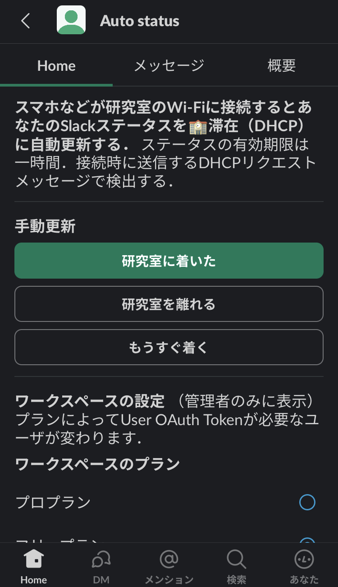

# slack_status_dhcp
Update slack status when receiving DHCP request message.

DHCPリクエストメッセージを受信したときに，そのユーザのSlackステータスを自動更新する．
MACアドレス（Wi-Fiアドレス）とSlackユーザの対応をアプリで設定することで実現する．

RubyスクリプトとSlackアプリで役割分担する．
設定とステータス監視はアプリで，ステータス変更はスクリプトでする．

在室ステータス
- emoji :school:
- text 在室（DHCP）
- expire 1 hour (default)



## 動かす
Slackワークスペースに新しいアプリを追加し，signing_secret, bot_token, slack_app_tokenをslack_app_token.shに書き写す．アプリ追加の詳しい手順は InstallSlackApp.md にある．

動作確認と設定ファイルslack_setting.json生成のため，最初は javaScript だけ動かす．
Slackのアプリホームが表示できるようになる．
javaScriptだけでは，「研究室に着いた」などのボタンは押してもステータスは変更されない．
表示できたらCtrl+Cなどでnodeを止める．
```
$ . ./env.sh
$ node slack_app.js
```

Rubyスクリプトを実行する．
Slackのアプリホームで User OAuth Token を保存すると「研究室に着いた」などのボタンが正常に動作する．
MACアドレスを保存して，自動更新するのチェックをつけると，DHCPリクエストメッセージを受信したときにSlackステータスを変更するようになる．
自動更新するのチェックを外すとSlackステータスは変更されない．
バックグランド実行ような工夫はしていないのでターミナルを一つ占有する．
```
$ ruby slack_app.rb
```

## Raspberry Pi 400
Raspberry Pi OS Debian version 11 (bullseye) で動かしたいとき．
- nodejs を v.12からv.18に更新．
  ```
  $ curl -fsSL https://deb.nodesource.com/setup_18.x | bash - 
  $ apt-get install -y nodejs
  ```
- rubyでHDCPリクエストのポート67を受信するためにruby2.7に権限を与える
  ```
  $ ls -l `which ruby`
  $ sudo setcap cap_net_raw,cap_net_bind_service+eip /usr/bin/ruby2.7
  ```

## まだできてないこと
- 自動更新を使っている人のリストをホームに表示する．
- 古い自動更新メッセージを消す．メッセージがある日のうち，直近1週間分を残す．（プライバシ）
- ユーザ自信が振り返れるように，日毎に入室をまとめたメッセージを送る．
- 有料プランでUser OAuth Tokenを削除するときに警告する．

## 役割分担
- Rubyスクリプト:
  - ブロードキャストされるDHCPリクエストメッセージを捕まえて，
	リクエスト端末に対応するSlackユーザのステータスを在室に変更する．
	在室ステータスの有効期限はユーザがSlackアプリで設定した時間にする．
	規定値は1時間にする．
  - ステータス変更をSlackのアプリメッセージに残す．
  - メッセージにログを残す．有効・無効の切り替え．設定の保存．ステータス
    自動更新，アプリの起動・終了．
  - (未実装) IPアドレスがわかった場合は定期的にpingを送り，ping応答が一定時間な
    ければSlackユーザのステータスを空に変更する．
  - ユーザが自分で変更している場合は変更しない．ユーザが:school:「在室
    （DHCP）」Rubyで指定した時間のいずれかを変更したら，変更しない．ユー
    ザが変更したかはSlackアプリでuser_changeを監視しないと分からない．
- Slack Boltアプリ:
  - 端末のMACアドレス（Wi-Fi アドレス）とユーザIDの対応を保存する．
  - 在室ステータスの有効時間を設定する．規定値は1時間
  - user_changeを監視してRubyスクリプトにステータス変更を伝える．
- アプリからスクリプトへの通知方法
  - ファイル名: slack_users.json
  - アプリは読み書き．
  - スクリプトは実行開始時に読み取りのみ．その後のステータス変更はアプリからスクリプトにパイプで伝える．
  - node-json-db
	https://www.npmjs.com/package/node-json-db

## Slackワークスペースの設定
### Socket Mode
- on
### App Home
- Show Tabs: Home Tab on
- check: Allow users to send Slash commands and messages from the messages tab

### OAuth & Permissions
- Bot Token Scopes
  - users:read (Slackアプリ users.list, user_change)
  - chat:write (Rubyスクリプト chat.postMessage)
  - (未使用) users.profile:read (Rubyスクリプト users.profile.get, User token でも可なAPI)
  - (未使用) im:read (Rubyスクリプト conversations.list)
  - (未使用) channels:read (Rubyスクリプト conversations.list)
- User Token Scopes
  - users.profile:write (Rubyスクリプト users.profile.set)
### Event Subscriptions
- bot events
  - app_home_opened
  - user_change (scope users:read)
- user events
  no events
### 使う人全員
Installed App Settings
https://api.slack.com/apps/app_id/install-on-team?
app_idの部分はアプリケーションのID（A0.........．Your AppsのApp Credentialsで確認できる）

# インストール作業の記録
## MacOSにnodejsをインストールする
```ターミナル
% brew install node
% brew info node
==> node: stable 19.3.0 (bottled), HEAD
Platform built on V8 to build network applications
https://nodejs.org/
/opt/homebrew/Cellar/node/19.3.0 (2,157 files, 53.3MB) *
```

## Slack appの作成
https://slack.dev/bolt-js/ja-jp/tutorial/getting-started に沿って

## package.jsonの作成
```
% npm init # package.json を作成
% npm install @slack/bolt
export SLACK_SIGNING_SECRET=<your-signing-secret>
export SLACK_BOT_TOKEN=xoxb-<your-bot-token>
```
## Slackアプリの作成
https://slack.dev/bolt-js/ja-jp/tutorial/getting-started
- Socketモード．
- ボットトークンとアプリレベルトークンを使用する例．

## ソケットモード
https://slack.dev/bolt-js/ja-jp/tutorial/getting-started#setting-up-events
ソケットモードを有効にします。
- アプリの設定ページ「Socket Mode」を有効に切り替えます。
- Basic Information, Generate Token and Scopes, connections:write スコープを追加し、生成された xapp トークンをslack_app_token.shのSLACK_APP_TOKENに保存

## ホームタブの更新
https://slack.dev/bolt-js/ja-jp/concepts#publishing-views
- app_home_opened イベント
- views.publish API, Bot tokens

## ユーザステータス
ステータスを変更するのはRubyだけど，変更を監視するのはSlackアプリとややこしい．
- user_change イベント．Required scopes users:read. Works with Event API
- users.profile.set API．Required scopes User tokens, users.profile:write
  - user: ID of user to change. This argument may only be specified by
	admins on paid teams. (ワークスペースを有料プランにするか，使いたい人をAppのCollaboratorにしてUer tokenを一人ずつ発行する)
  - error: cannot_update_admin_user
  - error: not_admin
- users.list API. Required scopes Bot tokens or User token, users:read

## node-json-dbファイルのロック
パイプでつなぐのが無難そう．
nodejsをRubyのサブプロセスにしてnodejsの標準出力でRubyスクリプトに通知する？
Nodejs Child Process
https://nodejs.org/docs/latest-v17.x/api/child_process.html

名前付きパイプもいいかも?
あるいは，db.pushの前にロックファイルを作成して終わったら削除してその場しのぎするか．
```
await db.push("/test2/my/test/",10,false);
```
あるいは，どうせまれなので，スクリプト側でJSON構文のエラーを見つけたら再読み込みする．
あるいは，nodejsの子プロセスを使う？
If Node.js is spawned with an IPC channel,
https://nodejs.org/docs/latest-v17.x/api/child_process.html#asynchronous-process-creation

## 二つのトークン
BoltはbotTokenだけでなんとかなる．

userTokenも必要になったら以下の対応が必要．
https://slack.dev/bolt-js/ja-jp/concepts#authorization
- botTokenとuserTokenはわかったけど．botIdとbotUserIdはよく分からない．
  botIdはbots.infoで取れそうだ．
  botUserIdは分からないからなしで．
- node_modules/@slack/bolt/dist/App.js
- Appの引数にtokenではなくauthorize関数を渡す．
  authorize関数（authorizeFn）ではteamIdも確認する．
  slack_app_token.sh SLACK_TEAM_ID
  auth.test API で team_id が返される．

## users.list
```
memebers: [{
  "is_admin": true
  "is_owner": false
  "is_primary_owner": false
  "is_app_user": false // appをインストールしたユーザかどうかだと思ったけど違いそう
}]
```
### user_change イベント
- ステータスの有効期限が来てもイベントが発生する．
  updatedフィールドもこの時刻．

### App ID と Team ID をどう取得するか
app_home_openedイベントの
evnet.view.team_id: "T0........."
evnet.api_app_id: "A0........."

## RaspberryPi（Debian）でソケットのパーミションを得る．
すぐに試すならsudoだけど，rootで動かすのは気持ち悪い．
```
slack_app.rb:xxx:in `bind': Permission denied - bind(2) for "0.0.0.0" port 67 (Errno::EACCES)
```
setcap でソケットの部分の権限を得る．rubyに権限を与える．
```
$ ls -l `which ruby`
..... /usr/bin/ruby -> ruby2.7
sudo setcap CAP_NET_BIND_SERVICE,CAP_NET_RAW+eip /usr/bin/ruby2.7
```

## nodejs
バージョン18以上で動作確認（19.3.0でも動作）
Raspberry Pi OS - Debian version 11 (bullseye) だとバージョン12．

バージョン12.22.12では require('node-json-db')するときに node-json-db/dist/lib/ArrayInfo.js:15 の ?? 演算子のところで文法エラー．

